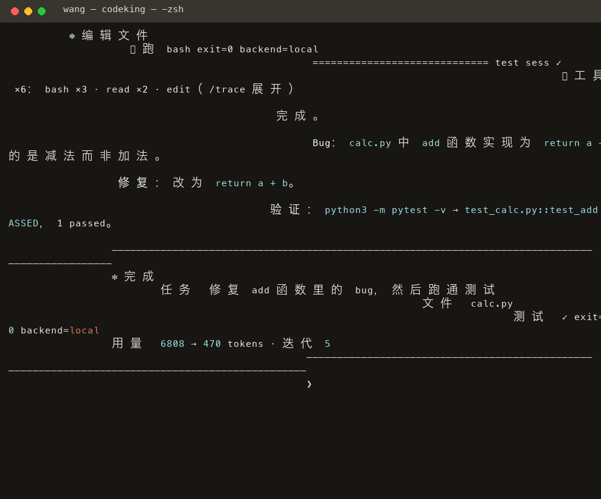

<h1 align="center">💻 CoderKing</h1>

<p align="center">
  <a href="https://github.com/ByteTitan-star/CodingKing/releases/tag/v1.2.0"></a>
  
  <a href="LICENSE"></a>
  <a href="https://github.com/ByteTitan-star/CodingKing/actions/workflows/ci.yml?query=branch%3Amain"></a>
  
  <a href="./README_zh.md"></a>
</p>

> Describe an engineering task in natural language — the coding agent edits code with read/write/edit/bash, verifies with tests in a sandbox, and keeps iterating until checks pass. One Agent Runtime powers both CLI and Web.

<p align="center">
  <a href="./docs/showcase/demo.html"><strong>Open workspace demo</strong></a>
  &nbsp;·&nbsp;
  <a href="./docs/CoderKing-Technical-Design.md"><strong>Read technical design</strong></a>
</p>

## What is CoderKing?

CoderKing is an autonomous **coding agent** runtime (Pi-aligned). You describe a task in natural language; a single agent loop uses four tools (`read` / `write` / `edit` / `bash`) to change the repository, run checks in an isolated sandbox, and continue until verification passes. CLI and Web share the same runtime — there is no fixed multi-role workflow.

Phase 1 is a runnable MVP (Python runtime + React workspace in one repo), not a multi-tenant SaaS.

## How the agent works

| Step | What happens |
| --- | --- |
| Task | You describe a bug fix, feature, or refactor in CLI or Web. |
| Loop | The model chooses tools each turn (explore → edit → run checks). |
| Verify | After edits, it runs tests/lint via `bash` (prompt-guided; optional `--test` hint). |
| Iterate | On failure, it diagnoses from tool output and edits again. |
| Deliver | Stops when the task is done and verification passed; review the diff. |

## Product showcase

Screenshots below capture the **v1.2.0 surfaces**. CLI and Web/Desktop run the same agent loop on a failing-test repair task (`a - b` → `a + b`).

### CLI (the primary surface)



Bare `codeking` drops into the REPL: banner → describe a task → the agent explores, edits, and verifies (`⏺ 工具 ×5` collapsed summary, `/trace` to expand) → reply rendered as Markdown → result summary.

### Desktop / Web workspace


The redesigned conversation-first workspace: session sidebar with resume, streaming Markdown replies, working plan, collapsible tool and subagent traces, inline diff summary, and a composer with permission / model / reasoning-effort selectors — while the right panel tracks files, diffs, checkpoints and test output.

### Unified diff


Review exactly what changed — per-line diff with add/delete highlighting and +/- stats — before accepting or rolling back, or undo directly from the inline summary in the conversation.

## Product interface

| CLI | Desktop / Web workspace | Diff & runtime |
| --- | --- | --- |
|  |  |  |
| Streaming REPL with session management and slash autocomplete. | Describe a task, watch the orchestrated agent work, and inspect changed files. | Inspect unified diffs, checkpoints, and test results side by side. |

Screenshots live under [`docs/showcase/`](docs/showcase/); the desktop captures are rendered from the v1.2.0 UI.

## Core features

| Feature | Description |
| --- | --- |
| Unified runtime | CLI and Web call the same Agent Runtime — no duplicate orchestration logic. |
| Pure agent loop | Pi-aligned ReAct-style loop without LangChain / LangGraph and without fixed role stages. |
| Four atomic tools | `read` / `write` / `edit` / `bash` only — the model decides the order. |
| Subagents & dynamic workflow | Opt-in `agent` + `plan` tools: delegate to read-only `explore` or `general-purpose` subagents, run same-turn delegations in parallel (fail-closed behind `dynamic_workflow`). |
| Reasoning effort | `off` / `low` / `medium` / `high` / `ultra` selectable at runtime with graceful backend fallback. |
| Durable tasks | Session tree with branch/resume, retry indexing, file checkpoints with per-checkpoint rollback. |
| Prompt verification | After edits, run checks with bash; optional `--test` soft hint (not a hard gate). |
| Sandbox execution | Docker-first isolation; local process fallback for development only. |
| Model-agnostic | OpenAI-compatible APIs — DeepSeek, GLM, Qwen, Ollama, and similar gateways. |
| Human-in-the-loop | Dangerous operations require explicit approval unless `--yes` is set. |
| Evaluation harness | Scripted tasks for `bug_fix`, `feature_add`, and `refactor`. |
| Live observability | Web UI shows tool trace, terminal output, diff, and sandbox status. |

<p align="center">
  <a href="./docs/showcase/demo.html"><strong>Explore the workspace demo</strong></a>
  &nbsp;·&nbsp;
  <a href="./docs/phase1-acceptance.md"><strong>Phase 1 acceptance checklist</strong></a>
</p>

## Architecture

```text
User → CLI / Web UI → FastAPI + WebSocket
                         ↓
                   Agent Runtime
                         ↓
              L1 pure loop: Perceive → Decide → Act → Observe
                         ↓
              Tools (read/write/edit/bash) → Sandbox → Workspace
```

`coderking run` invokes the runtime in-process (no HTTP server required). `coderking serve` exposes the same runtime to the Web UI.

## Quick start

**Requirements:** Python 3.12+, Node 22+ (Web only), Docker optional.

> 📖 New to CodeKing? Start with the **[CLI 使用指南](docs/cli/README.md)** — a complete beginner tutorial covering every command (`run`, `new`, `-r` session resume, and more) with examples.

### Install (any of the three)

```bash
# one-line script — no account needed
curl -fsSL https://raw.githubusercontent.com/ByteTitan-star/CodingKing/main/install.sh | sh

# npm
npm install -g codeking

# from source
python -m venv .venv && source .venv/bin/activate && pip install -e ".[dev]"
```

All three give you a global `codeking` command. Configure any OpenAI-compatible model once in `~/.coderking/.env` (global) or `<project>/.env` (per-project override):

```env
CODERKING_OPENAI_BASE_URL=https://api.deepseek.com   # or open.bigmodel.cn/api/paas/v4, ...
CODERKING_OPENAI_API_KEY=sk-...
CODERKING_MODEL=deepseek-chat
```

### CLI

```bash
codeking                          # bare command → interactive REPL (splash + streaming replies)
codeking new                      # start a fresh session (old ones are kept)
codeking -r                       # pick a past session to resume (claude-style)
codeking sessions                 # list sessions: id / task / tokens / node count
codeking session tree             # inspect the current append-only session tree
codeking session fork --from <id> --name <new-id>
codeking run "Fix failing unit tests in this repo" -w .      # one-shot task
codeking status && codeking diff && codeking test
codeking tasks --status failed && codeking retry <task-id>
codeking checkpoint list <task-id>
codeking checkpoint rollback <checkpoint-id> --task <task-id> --yes
codeking skills list
codeking tools check && codeking mcp check
```

In-chat: `/new` new session · `/trace` expand the collapsed tool trace · `/skills` list Skills · `/context`/`/compact` manage long context · `/reload` rescan resources · `/exit` quit. Slash commands autocomplete with descriptions. Replies stream token-by-token and render as Markdown; tool activity is collapsed to one summary line.

Task JSON and append-only session JSONL remain the portable sources of truth. `.coderking/state.db`
is a rebuildable SQLite index for status queries, event cursors, and execution leases; direct file-write
tools also create binary-safe checkpoints under `.coderking/checkpoints/` before mutation.

Configuration priority: shell env → project `.env` → `~/.coderking/.env` → `.coderking/config.yaml` → defaults. API keys are read from the environment only and must not be committed.

Use `--yes` to auto-approve dangerous operations. Use `--commit` to allow the agent to run `git commit`.

### Web

```bash
codeking serve --port 8000
```

In another terminal:

```bash
cd web && npm install && npm run dev
```

Open `http://127.0.0.1:5173`. For production, run `npm run build` — FastAPI serves `web/dist` when present. The Desktop shell (`cd desktop && npm start`) loads the same UI over stdio JSON-RPC — no server needed.

## Configuration

| Variable | Description |
| --- | --- |
| `CODERKING_OPENAI_BASE_URL` | OpenAI-compatible API base URL |
| `CODERKING_OPENAI_API_KEY` | API key (never commit to Git) |
| `CODERKING_MODEL` | Model name |
| `CODERKING_DISABLE_THINKING` | Disable reasoning-model `thinking` field |
| `CODERKING_SANDBOX_MODE` | `auto`, `docker`, `local`, or `microvm` |
| `CODERKING_MAX_ITERATIONS` | Max agent-loop turns (default 24) |
| `CODERKING_ALLOW_COMMIT` | Allow the `git_commit` tool |
| `CODERKING_CONTEXT_WINDOW` | Active model context window (default 128000) |
| `CODERKING_COMPRESSION_ENABLED` | Enable automatic long-context compression (default true) |
| `CODERKING_COMPRESSION_THRESHOLD` | Full-compression window threshold (default 0.75) |
| `CODERKING_MICRO_COMPACTION_ENABLED` | Compact old large tool results before full compression (default true) |
| `CODERKING_MICRO_COMPACTION_THRESHOLD` | Micro-compaction trigger relative to the full budget (default 0.5) |
| `CODERKING_MICRO_COMPACTION_KEEP_RECENT_TOOL_RESULTS` | Recent tool results protected from micro-compaction (default 4) |
| `CODERKING_MICRO_COMPACTION_MIN_OUTPUT_CHARS` | Minimum eligible tool-output size (default 2000) |
| `CODERKING_DYNAMIC_TOOLS_ENABLED` | Enable workspace dynamic tools (default false) |
| `CODERKING_MCP_ENABLED` | Enable allowlisted MCP tools (default false) |

If the upstream API rejects the `thinking` field, the client strips it and retries once automatically.

## Development

```bash
pre-commit install                 # commit-time autofix + push-time CI-parity gates
pytest -q -m "not docker and not live"
ruff check src tests scripts packages && ruff format --check src tests scripts packages
python scripts/check_layer_deps.py
cd web && npm run lint && npm run build
```

With Docker available: `pytest tests/test_docker.py`.

See [CONTRIBUTING.md](CONTRIBUTING.md) for scope, commit conventions, and the exact pre-push checklist. CI runs via [`.github/workflows/ci.yml`](.github/workflows/ci.yml) (unit tests skip Docker by default; a separate `docker-sandbox` job runs Docker integration tests).

## Repository layout

```text
src/coderking/     Python runtime, CLI, and API
web/               React + Vite workspace
eval/tasks/        Evaluation scenarios
tests/             Unit tests
docs/              Design docs, showcase assets, and acceptance checklist
```

## Documentation

- [Technical design](docs/CoderKing-Technical-Design.md)
- [Web UI & CLI design](docs/CoderKing-WebUI-CLI-Design.md)
- [Phase 1 acceptance](docs/phase1-acceptance.md)

## License

MIT © CodeTitan, 2026 — see [LICENSE](LICENSE).
