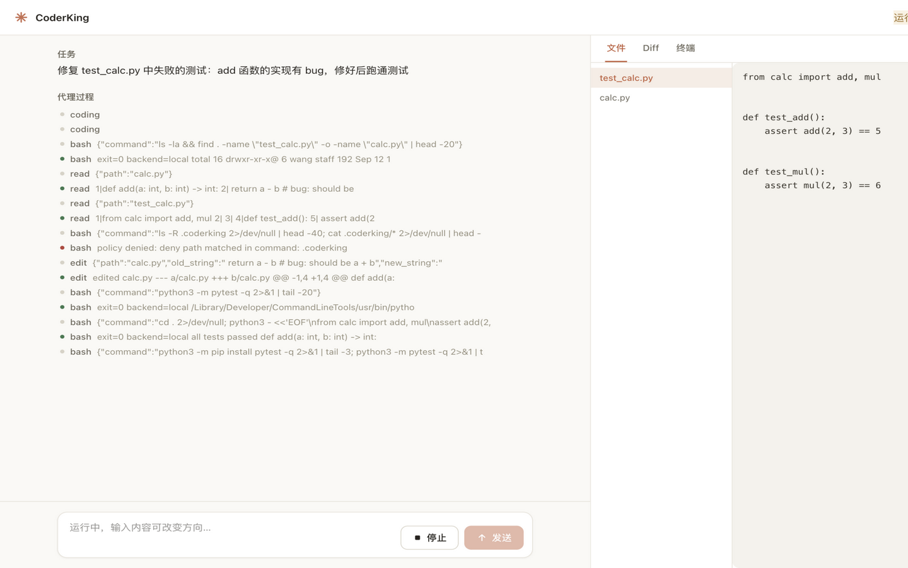
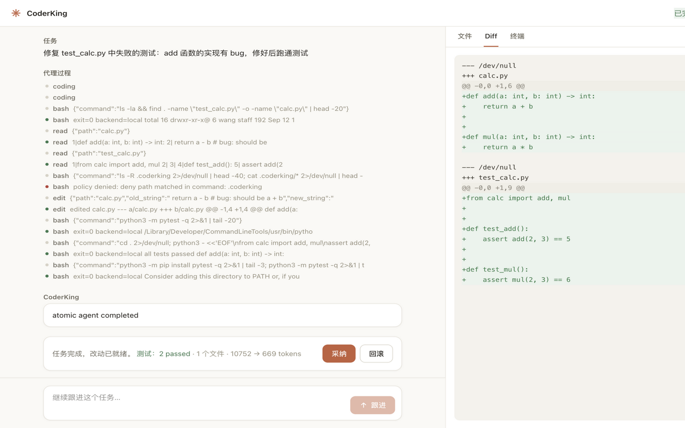

<h1 align="center">💻 CoderKing</h1>

<p align="center">
  <a href="https://github.com/ByteTitan-star/CodingKing/releases/tag/v1.0.6"></a>
  
  <a href="LICENSE"></a>
  <a href="https://github.com/ByteTitan-star/CodingKing/actions/workflows/ci.yml?query=branch%3Amain"></a>
  <a href="./README.md"></a>
  
</p>

> 用自然语言�述工程任务 —�自动规划�改代��在沙箱里跑测试，失败则进入修�循�，直到验�通过。CLI �Web 共用�一�Agent Runtime�

<p align="center">
  <a href="./docs/showcase/demo.html"><strong>打开工作�Demo</strong></a>
  &nbsp;·&nbsp;
  <a href="./docs/CoderKing-Technical-Design.md"><strong>阅读技术方�/strong></a>
</p>

## CoderKing 是什么？

CoderKing 是一个��软件工程场景的自主 Coding Agent �行时。你用自然语言�述任务，Agent 会规划步骤�修改仓库�在隔离沙箱中执行命令�测试；验�失败时自动进入 Repair 循� —�CLI �Web 工作�调用的是�一�Runtime，而�是两套��逻辑�

第一期是��行的 MVP（Python Runtime + React 工作��仓），�是多租户 SaaS�

## Agent 工作�

| 阶段 | 关键动作 | 阶段产出 |
| --- | --- | --- |
| 任务输入 | �CLI �Web 中��bug 修��功能或��需求�| 清晰的工程任务说�|
| 规划 | 将任务拆��审查的步骤�| 结�化任务计�|
| 编� | 在仓库中读���索�编辑文件�| 补��的�� |
| 执行 | 在沙箱中�行 shell �测试�| 命令�测试输�|
| 审查 | 对照计划�diff 验�结��| 通过 / 失败判定 |
| 修� | 测试失败时诊断并�次修改�| 修正�的�� |
| 交付 | 输出 diff 摘�；�选�批准�git commit�| 完�的任�|

## 产�展示

### 修�循��战



�测失败�，Agent �次�过 Planner �Coding �Execution �Repair。工作�在�一视图展示计划�工具调用�改动文件� pytest 输出�

### 统一 Diff



在��或�滚�精确查看改动内�—��Reviewer 角色用�验收的是�一�diff�

## 产�界�

| 工程工作�| Diff ��行时 |
| --- | --- |
|  |  |
| �述任务�查看计划� Agent 活动��览改动文件�| 并�查看统一 diff�终端输出�测试结��|

截图资��� [`docs/showcase/`](docs/showcase/)。��`python scripts/capture_showcase.py` ���demo 页��，或在真�任务跑通�替�素��

## 核心能力

| 能力 | 说� |
| --- | --- |
| 统一 Runtime | CLI �Web 共用 Agent Runtime，����编��|
| ReAct + Reflection | 自研 Agent 循�，��赖 LangChain / LangGraph�|
| 角色化工具��| Planner / Coding / Execution / Reviewer / Repair，�角色工具集隔离�|
| 沙箱执行 | Docker 为主；无 Docker �local 进程仅作开�fallback，事件�会标��|
| 多模�兼�| OpenAI Compatible 网关 —�DeepSeek�GLM�Qwen�Ollama 等� `base_url` ���|
| 人机�� | 删文件���shell�`git commit` 等默认需确认；`--yes` �自动批准�|
| 评测体系 | `eval/tasks` 覆盖 `bug_fix`�`feature_add`�`refactor`�|
| �观�| Web 展示计划�Tool Trace�终端输出�Diff �Sandbox 状��|

<p align="center">
  <a href="./docs/showcase/demo.html"><strong>体验工作�Demo</strong></a>
  &nbsp;·&nbsp;
  <a href="./docs/phase1-acceptance.md"><strong>第一期验收清�/strong></a>
</p>

## ��

```text
User �CLI / Web UI �FastAPI + WebSocket
                         �
                   Agent Runtime
                         �
              Planner �Coding �Execution �Reviewer
                         �Repair �
                         �
              Tools �Sandbox �Workspace
```

`coderking run` 默认进程内直�调�Runtime，无需先起 HTTP �务；`coderking serve` 将�一 Runtime 暴露�Web�

## 快速开�

**�境�求�* Python 3.12+，Node 22+（仅 Web），Docker �选�

```bash
python -m venv .venv
source .venv/bin/activate          # Windows: .venv\Scripts\activate
pip install -e ".[dev]"
cp .env.example .env
```

编辑 `.env`�

```env
CODERKING_OPENAI_BASE_URL=https://api.deepseek.com/v1
CODERKING_OPENAI_API_KEY=sk-...
CODERKING_MODEL=deepseek-chat
CODERKING_DISABLE_THINKING=true
CODERKING_SANDBOX_MODE=auto
```

### CLI

```bash
coderking init
coderking config model --base-url https://api.deepseek.com/v1 --model deepseek-chat
coderking run "修�当�仓库里失败的�元测试" --workspace .
coderking chat --workspace .
coderking status
coderking stop <task_id>
coderking eval --path eval/tasks --report-dir eval/reports
```

�置优先级：CLI �数 > �境�� / `.env` > `.coderking/config.yaml` > 默认值。API Key �走�境��，勿写入 yaml 或��Git�

### Web

```bash
coderking serve --port 8000
```

�开终端�

```bash
cd web && npm install && npm run dev
```

�览器打开 `http://127.0.0.1:5173`。生产�境执�`npm run build` �，FastAPI 会托�`web/dist`�

## �置

| �� | �义 |
| --- | --- |
| `CODERKING_OPENAI_BASE_URL` | OpenAI Compatible 网关 |
| `CODERKING_OPENAI_API_KEY` | API Key，勿�交�Git |
| `CODERKING_MODEL` | 模��|
| `CODERKING_DISABLE_THINKING` | 关闭��模� thinking 字段（默�true�|
| `CODERKING_SANDBOX_MODE` | `auto` / `docker` / `local` |
| `CODERKING_ALLOW_COMMIT` | 是��许 `git_commit` 工具 |

若上�API �支�`thinking` 字段，客户端会自动��该字段并�试一次�

## 开�� CI

```bash
pre-commit install
pre-commit run --all-files
pytest -q -m "not docker"
ruff check src tests
cd web && npm run lint && npm run build
```

本机�Docker 时�跑：`pytest tests/test_docker.py`�

贡献约定�[CONTRIBUTING.md](CONTRIBUTING.md)。CI �置�[`.github/workflows/ci.yml`](.github/workflows/ci.yml)（默�job 跳过 Docker；��`docker-sandbox` job）�

## 仓库布局

```text
src/coderking/     Python Runtime�CLI�API
web/               React + Vite 工作�
eval/tasks/        评测场景
tests/             �测
docs/              设计文档�展示素��验收清�
```

## 文档

- [技术方案](docs/CoderKing-Technical-Design.md)
- [Web UI �CLI 设计](docs/CoderKing-WebUI-CLI-Design.md)
- [第一期验收](docs/phase1-acceptance.md)

## License

MIT © CodeTitan, 2026 �详� [LICENSE](LICENSE)�
